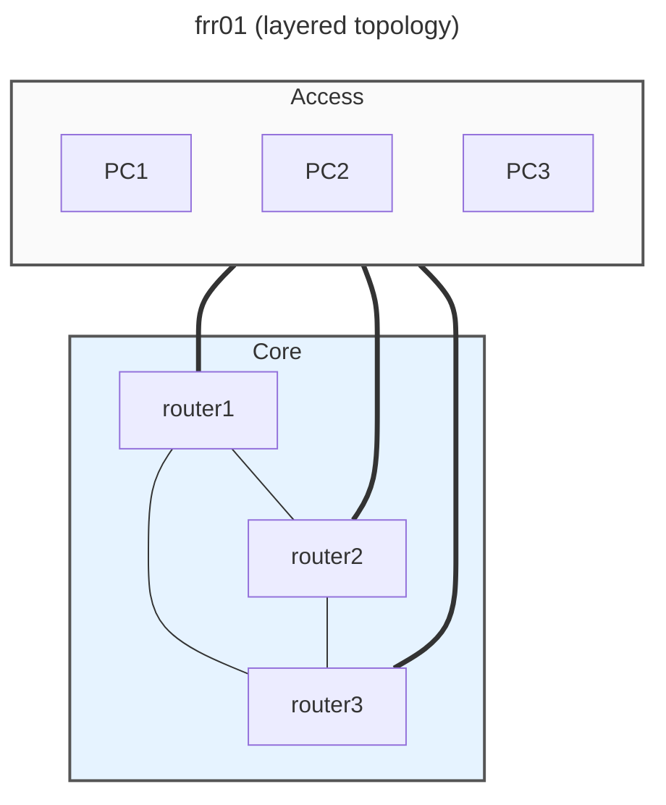

# pytest-clab-frr01

A pytest validation suite for a [containerlab](https://containerlab.dev/) **frr01** network lab.  
The lab runs three FRRouting routers and three Alpine PC clients connected via OSPF and VLAN 100 bridges. Zabbix monitors all six nodes via the Zabbix agent.  
Test results are exported to Grafana via the Prometheus Pushgateway, and Grafana dashboards visualise pass/fail trends and per-test durations across continuous test sweeps.

---

## Objectives

- Validate connectivity and interface state on all clab nodes via CLI
- Confirm Zabbix host inventory matches the clab topology
- Verify Zabbix LLD discovers the VLAN 100 interfaces on each router
- Test failure-detection: shut down an interface → Zabbix raises a PROBLEM
- Test recovery: restore the interface → Zabbix clears the PROBLEM
- Back up FRR configs programmatically during test runs
- Expose test results to Grafana in real time using the Prometheus Pushgateway
- Run the full suite continuously and track pass-rate trends

---

## Lab Topology

All nodes share the `digital-twin` Docker bridge network (172.18.0.x) for management.  
Routers expose SSH (22), SNMP (161/udp), BGP (179), FRR daemons (2601/2605/2608), and the Zabbix agent (10050).  
VLAN 100 is created on each router's eth1–eth3 uplinks and bridged (br100) with STP enabled.

---

## Stack

| Component | Details |
|---|---|
| Containerlab | frr01 topology — 3 × FRRouting routers, 3 × Alpine PCs |
| Router image | `quay.io/frrouting/frr:10.5.0-with-ssh-snmp-zbx-softflowd-iperf3-lldp` |
| PC image | `alpine:3.23.0-with-ssh-snmp-zbx-softflowd-iperf3` |
| Zabbix | `zabbix-docker` compose stack on the `digital-twin` network |
| Grafana | Port 5000 → 3000, dashboards provisioned via REST API |
| Virtual env | `~/git/pytest-virtual-environment` (Python 3.12) |

---

## Test Suite

| File | What it tests |
|---|---|
| `test_01_mgmt_cli.py` | Management interface (eth0) is UP on all 6 nodes |
| `test_02_interfaces_cli.py` | All router interfaces show expected state via CLI |
| `test_04_get_hosts_zabbix.py` | Zabbix host inventory matches clab node names |
| `test_05_backup_configs.py` | FRR configs backed up from all 3 routers |
| `test_06_shutdown_interface.py` | eth1.100 on router1 is brought down |
| `test_07_mgmt_cli_after_failure.py` | Management interfaces still UP after eth1.100 failure |
| `test_08_vlans_zabbix.py` | Zabbix LLD discovers VLAN 100 interfaces on all routers |
| `test_09_zabbix_problem.py` | Zabbix raises a PROBLEM for eth1.100 down (≤ 60 s) |
| `test_11_restore_interface.py` | eth1.100 on router1 is restored |
| `test_12_interfaces_zabbix_after_failure.py` | Zabbix clears the problem after restore |

---

## What Worked Well

- **Containerlab** deploys a full L2/L3 lab with OSPF, STP, and VLAN sub-interfaces in under 60 seconds — ideal for repeatable pytest validation.
- **FRRouting with Zabbix agent baked in** means zero extra configuration to get monitoring — the agent starts automatically and Zabbix can discover it immediately.
- **Zabbix LLD** (`net.if.*` item keys) automatically discovers sub-interfaces like `eth1.100` without manual item creation.
- **Zabbix problem detection** (`problem.get` API) provides a reliable programmatic way to poll for interface DOWN events — no screen-scraping required.
- **`docker exec` via subprocess** is the simplest reliable way to run CLI commands on clab nodes from pytest — no SSH overhead, no key management.
- **`scope="module"` fixtures** avoid re-establishing connections for parametrised test cases in the same file.

---

## Problems Encountered and Tips

### Zabbix trigger latency
Zabbix does not detect interface problems instantly. The agent polling interval and trigger evaluation add up to ~30–60 s from interface down to problem raised.  
**Tip:** Poll `problem.get` in a loop with a 60 s timeout and 5 s interval — don't assert immediately after shutting the interface down.

### Zabbix host naming vs clab node naming
Clab node names are `clab-frr01-router1` but Zabbix hosts may be registered as `router1` (the bare name). The test strips the `clab-frr01-` prefix before comparing.  
**Tip:** Decide on a naming convention upfront and enforce it in `helpers.py` constants.

### Interface naming consistency
`docker exec ip link show` output varies between Linux distributions — check whether the interface shows `UP` in the flags vs the `state` field.

### Zabbix token file not committed
The Zabbix API token (`zabbix_token.txt`) is excluded from git for security. Each user must generate their own from the Zabbix web UI (Administration → API tokens).

### FRR config backup uses relative paths
`helpers.py:backup_frr_config()` writes to `backups/<container>.conf` using a relative path — always run pytest from the clab lab directory (`~/git/containerlab/lab-examples/frr01`), not the git repo root.

### Virtual environment path
The venv activate script is at `~/git/pytest-virtual-environment/.venv/bin/activate` (note the `.venv` subfolder — the path in the task description omits it).

### STP convergence after restore
After restoring eth1.100 on router1, STP may take 30–50 s to reconverge before the interface is fully forwarding. Tests that check interface state after restore should account for this.

### Continuous sweep results
34 consecutive runs × 12 tests = **408 test executions with 0 failures.** Average run time ~2 minutes, dominated by the 40 s Zabbix problem detection and clear wait.
