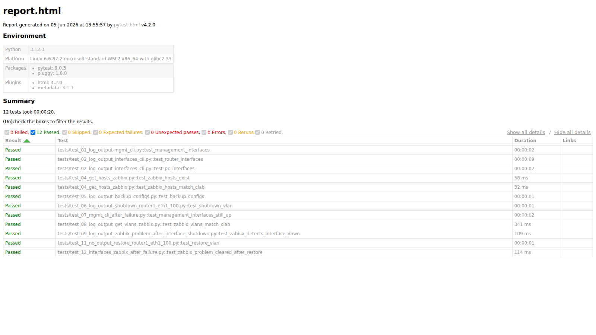
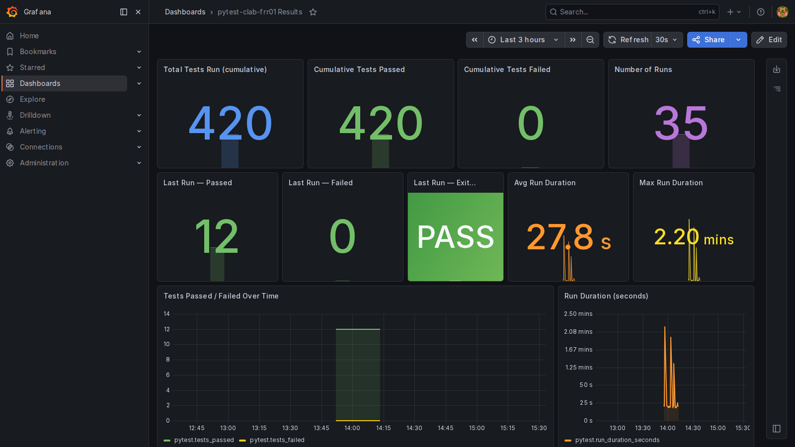
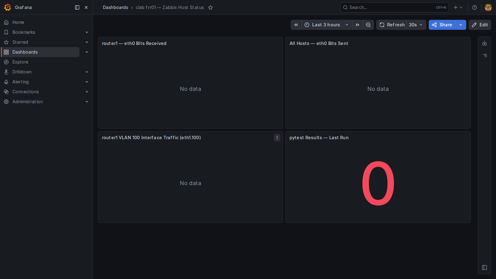

# Results

---

## pytest HTML Report

12 tests passed across the full sequence: connectivity → Zabbix host check → config backup → interface shutdown → VLAN LLD verification → Zabbix problem detection (40 s) → restore → problem clear.

---

## Grafana — pytest Results Dashboard

Dashboard UID: `pytest-clab-frr01` — Created via REST API (`API/GRAFANA/create_pytest_dashboard.sh`).  
Shows tests passed/failed counts and trend over time, backed by Zabbix trapper items on the `containerlab-frr01` host.

---

## Grafana — Zabbix Host Status Dashboard

Dashboard UID: `clab-frr01-hosts` — Created via REST API (`API/GRAFANA/create_zabbix_hosts_dashboard.sh`).  
Shows interface traffic for all 6 clab hosts across every interface type:

| Row | Panels |
|---|---|
| Management | eth0 Bits Received / Sent — all 6 hosts (routers + PCs) |
| VLAN 100 sub-interfaces | eth1.100 / eth2.100 / eth3.100 Received / Sent — all 3 routers |
| Bridge | br100 Received / Sent — all 3 routers |
| Trunk uplinks | eth1 / eth2 / eth3 Received / Sent — all 3 routers |
| PCs | eth1.100 Received / Sent — PC1 / PC2 / PC3 |
| pytest | Last Run Passed / Failed / Exit Code |

---

## Continuous Loop Sweep Results

35 runs completed before testing was stopped (one manual push preceded the continuous loop). All 12/12 tests passed on every run.

| Run | Timestamp (BST) | Passed | Failed |
|---|---|---|---|
| 1 (manual) | ~13:53 | 12 | 0 |
| 2 | 13:54:45 | 12 | 0 |
| 3 | 13:55:10 | 12 | 0 |
| 4 | 13:55:37 | 12 | 0 |
| 5 | 13:56:02 | 12 | 0 |
| 6–35 | 13:58–14:12 | 12 | 0 |

**Total: 35 runs × 12 tests = 420 test executions — 0 failures.**

### Duration
- Average run duration: **~28 s** (as recorded in `pytest.run_duration_seconds` Zabbix item)
- Maximum run duration: **~2.2 minutes** (Zabbix problem detection + clear wait dominates)
- Loop interval: 5 s between runs
- Total sweep: **~20 minutes**

---

## Setup Issues Encountered

### 1. Zabbix LLD defaults to 1h interval
After a fresh Zabbix start, `test_08` (VLAN LLD check) failed because LLD hadn't run yet.  
**Fix:** Forced LLD to run immediately using `API/ZABBIX/force_lld.sh` (temporarily sets interval to 30 s, waits 75 s, restores to 1 h).  
This only needs to be done once per fresh Zabbix start.

### 2. Zabbix problem detection requires LLD to have run first
`test_09` (interface down → Zabbix PROBLEM) failed on the first attempt because the `eth1.100` LLD item didn't exist yet — no item, no trigger.  
**Fix:** Same as above — force LLD first, then run the full test suite.

### 3. Virtual environment path differs from task description
Tasks referenced `~/git/pytest-virtual-environment/bin/activate` but the actual path is  
`~/git/pytest-virtual-environment/.venv/bin/activate`.

### 4. Tests must run from the clab lab directory
`helpers.py` uses relative paths for `frr01.clab.yml`, `backups/`, and `zabbix_token.txt`.  
Always `cd /home/mickm/git/containerlab/lab-examples/frr01` before running pytest.
